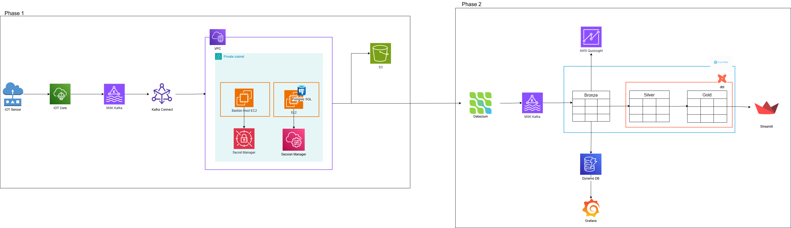

# On-Premise IoT Data Migration to AWS Cloud

Data Engineering Hackathon (Batch 03, instructor Qasim Hassan) submission:
an end-to-end pipeline that simulates on-prem IoT ingestion into
PostgreSQL, migrates it to Snowflake via CDC, transforms it with dbt, and
serves it through a Streamlit dashboard (plus a bonus DynamoDB/Grafana
time-series path).

**Status: both phases and the bonus are live and verified end-to-end** in
AWS account `300617413029` (us-east-1) - see [Live status](#live-status)
below for what was actually run and observed working.



See [`docs/architecture.md`](docs/architecture.md) for the full architecture
diagrams (both phases, also rendered as `docs/architecture-1.png` /
`docs/architecture-2.png`) and the full list of deliberate adaptations from
the brief. Two are load-bearing (not just naming differences) and worth
reading before you deploy:

- **Kafka Connect runs on a self-managed EC2 worker, not AWS MSK Connect.**
  This AWS account is gated from creating `AWS::KafkaConnect::Connector`
  resources (confirmed via CloudTrail - `AdministratorAccess` on every
  principal, custom plugin creation succeeds, only connector creation is
  denied with AWS's canned new-account message). Same connectors, same
  topic, same behavior - just an open-source Kafka Connect distributed
  worker on plain EC2 instead of the managed service.
- **The Task 2.5 bonus uses DynamoDB, not AWS Timestream.** Timestream for
  LiveAnalytics is also closed to new AWS accounts (confirmed via a live
  deploy attempt). DynamoDB (partition key `device_id`, sort key
  `event_time`) gives the same per-device time-range query pattern.

## Repo layout

```
infra/               CDK app (Python) - all AWS infrastructure
  stacks/
    network_stack.py         VPC, subnets, security groups, VPC endpoints
    secrets_stack.py         Secrets Manager (Postgres creds, Snowflake keypair + reader creds)
    msk_stack.py              MSK cluster (kafka.t3.small x2, IAM auth)
    postgres_stack.py         PostgreSQL EC2 + Bastion EC2 (both fully private)
    s3_backup_stack.py        S3 backup bucket + Kafka Connect plugins bucket
    kafka_connect_ec2_stack.py  Self-managed Kafka Connect on EC2: JDBC sink, S3 sink, (Phase 2: Debezium + Snowflake sink)
    iot_bridge_stack.py       IoT Things/policy/rule + IoT->Kafka bridge Lambda
    dynamodb_stack.py         Task 2.5 (bonus): DynamoDB table + Snowflake->DynamoDB Lambda
simulator/            Lightweight IoT Device Simulator substitute (Task 1.2)
iot-bridge-lambda/    IoT Core -> Kafka MSK bridge Lambda
kafka-connect/        Connector configs (JDBC sink, S3 sink, Debezium source, Snowflake sink)
postgres/             Schema DDL + CDC publication SQL
dbt/iot_analytics/    dbt project: staging -> silver -> gold Snowflake models
streamlit/            Task 2.4 dashboard
lambda-dynamodb/      Task 2.5 (bonus): Snowflake -> DynamoDB writer
grafana/              Task 2.5 (bonus): dashboard definition, ready to import
scripts/              Setup/deploy/verify helper scripts
docs/                 Architecture diagrams, screenshots, demo script
```

## Prerequisites

- AWS CLI configured with credentials that can create VPC/MSK/EC2/Lambda/IoT/IAM/S3/Secrets Manager/DynamoDB resources
- Node.js (for the CDK CLI via `npx aws-cdk`) and Python 3.11+ (the IoT bridge Lambda specifically needs 3.11 - see note in step 4)
- A Snowflake account (trial is fine) with `ACCOUNTADMIN` or equivalent
- `SNOWFLAKE_ACCOUNT` / `SNOWFLAKE_USER` / `SNOWFLAKE_PASSWORD` available as env vars for setup scripts and dbt - **never commit these**

## Setup & deploy

### 1. CDK app

```bash
cd infra
python -m venv .venv && .venv/Scripts/python -m pip install -r requirements.txt   # Windows
npx aws-cdk bootstrap aws://<account-id>/<region>       # one-time per account/region
npx aws-cdk deploy IotHackNetworkStack --require-approval never
npx aws-cdk deploy IotHackMskStack IotHackPostgresStack IotHackS3BackupStack --require-approval never --concurrency 3
```

MSK cluster creation alone takes ~20-30 minutes; the CDK stack also
resolves its IAM-auth bootstrap-broker string via a custom resource
(`kafka:GetBootstrapBrokers`) since `AWS::MSK::Cluster` doesn't expose it as
a native CloudFormation attribute.

### 2. Stage Kafka Connect plugin JARs (needs real internet access; run from your own machine)

```bash
python scripts/stage_kafka_connect_plugins.py <PluginsBucketName-from-S3BackupStack-output>
# Phase 2 connectors (Debezium + Snowflake), once you reach step 6:
python scripts/stage_phase2_plugins.py <PluginsBucketName-from-S3BackupStack-output>
```

### 3. Deploy Kafka Connect (self-managed EC2) + the IoT bridge

```bash
cd infra
npx aws-cdk deploy IotHackKafkaConnectStack IotHackIotBridgeStack --require-approval never
```

This provisions a plain EC2 instance running the open-source Kafka Connect
distributed worker (not AWS MSK Connect - see the note at the top of this
file). Boot takes a few minutes: it downloads Kafka, the AWS MSK IAM auth
library, and the plugin JARs from S3, then submits the JDBC sink and S3
sink connectors to its own REST API automatically. Check status:

```bash
aws ssm send-command --instance-ids <KafkaConnectInstanceId output> \
  --document-name AWS-RunShellScript \
  --parameters 'commands=["curl -s http://localhost:8083/connectors/jdbc-sink-postgres/status"]'
```

### 4. Provision simulated devices and run the simulator (Task 1.2)

```bash
bash simulator/provision_things.sh 5
ENDPOINT=$(aws iot describe-endpoint --endpoint-type iot:Data-ATS --query endpointAddress --output text)
python -m pip install -r simulator/requirements.txt
python simulator/device_simulator.py --endpoint "$ENDPOINT" --devices 5 --interval 5
```

**Note:** `infra/stacks/iot_bridge_stack.py` pins the bridge Lambda to
**Python 3.11**, not 3.12. kafka-python's vendored `six.py` fakes the
`six.moves` submodule via the legacy `find_module`/`load_module` import-hook
API, which Python 3.12 removed entirely - this breaks the Lambda's import
on 3.12 with `No module named 'kafka.vendor.six.moves'`. 3.11 still
supports the old hook.

Verify Phase 1 end-to-end: bridge Lambda CloudWatch Logs show successful
Kafka publishes -> JDBC sink connector status `RUNNING` -> rows appear in
`iot.iot_events` on Postgres (via SSM + psql through the bastion) -> objects
appear in the S3 backup bucket.

### 5. Snowflake setup (Task 2.2)

```bash
SNOWFLAKE_ACCOUNT=... SNOWFLAKE_USER=... SNOWFLAKE_PASSWORD=... \
SNOWFLAKE_SECRET_ARN=<SnowflakeKeypairSecret ARN from SecretsStack> \
python scripts/setup_snowflake.py
```

Creates `HACKATHON_IOT` with `RAW`/`CLEAN`/`ANALYTICS` schemas and a
key-pair-authenticated `KAFKA_CONNECTOR_SVC` service user, then pushes the
generated private key straight into Secrets Manager (never touches disk).

Grant your own querying role read access once, since objects the Kafka
connector creates are owned by `KAFKA_CONNECTOR_ROLE`:

```sql
GRANT SELECT ON ALL TABLES IN SCHEMA HACKATHON_IOT.RAW TO ROLE ACCOUNTADMIN;
GRANT SELECT ON FUTURE TABLES IN SCHEMA HACKATHON_IOT.RAW TO ROLE ACCOUNTADMIN;
```

### 6. Add the Debezium + Snowflake connectors and redeploy Kafka Connect

```bash
cd infra
ENABLE_PHASE2=true SNOWFLAKE_ACCOUNT=USCZIKZ-XEB03675 \
npx aws-cdk deploy IotHackKafkaConnectStack --require-approval never
```

`ENABLE_PHASE2=true` changes the Kafka Connect EC2 instance's user-data, so
CloudFormation replaces the instance (terminates the old one, boots a fresh
one that submits all four connectors: JDBC sink, S3 sink, Debezium source,
Snowflake sink). Two things the Snowflake sink specifically needs that are
easy to miss:

- **BouncyCastle FIPS jars** (`bc-fips`, `bcpkix-fips`, `bctls-fips`) - the
  Snowflake connector's fat jar excludes them for licensing reasons; without
  them connector creation fails with `NoClassDefFoundError:
  org/bouncycastle/...`. Already handled by the CDK stack's user-data.
- **Port 80 egress** for the Snowflake JDBC driver's OCSP (certificate
  revocation) checks against `ocsp.snowflakecomputing.com` /
  `ocsp.digicert.com` - without it, connector validation retries for
  several minutes before timing out. Already added to `sg_kafka_connect` in
  `network_stack.py`.

Verify: a manual `INSERT`/`UPDATE` on `iot.iot_events` shows up in the
`cdc.iot.iot_events` Kafka topic, then in Snowflake `RAW.IOT_EVENTS`
(confirmed live: row count increased within ~20 seconds of new Postgres
inserts).

### 7. dbt (Task 2.3)

```bash
cd dbt/iot_analytics
python -m pip install dbt-snowflake
dbt deps
dbt run --select staging silver gold
dbt test
dbt docs generate && dbt docs serve
```

### 8. Streamlit dashboard (Task 2.4)

```bash
python -m pip install -r streamlit/requirements.txt
SNOWFLAKE_ACCOUNT=... SNOWFLAKE_USER=... SNOWFLAKE_PASSWORD=... \
streamlit run streamlit/app.py
```

### 9. Bonus: DynamoDB + Grafana (Task 2.5)

```bash
cd infra
ENABLE_BONUS=true npx aws-cdk deploy IotHackDynamoDbStack --require-approval never
```

Populate the reader secret once (password-auth, since the Lambda just runs
a plain `SELECT` over `CLEAN.IOT_VALIDATED`):

```bash
aws secretsmanager put-secret-value --secret-id <SnowflakeReaderSecret ARN from SecretsStack> \
  --secret-string '{"account":"...","user":"...","password":"...","role":"ACCOUNTADMIN","warehouse":"COMPUTE_WH"}'
```

The Lambda runs every minute via EventBridge, reading new rows from
`CLEAN.IOT_VALIDATED` and writing them to the `iot-hack-timeseries`
DynamoDB table (a `__watermark__` item tracks the last-processed
`event_ts` so each run is incremental). Import
[`grafana/dynamodb-dashboard.json`](grafana/dynamodb-dashboard.json) into
any Grafana instance (self-hosted or AWS Managed Grafana) with the
community `marcusolsson-dynamodb-datasource` plugin installed - a live
Grafana server wasn't stood up for this submission (would need either AWS
Managed Grafana's IAM Identity Center/SSO setup or a new self-hosted EC2
box), but the writer Lambda and DynamoDB table are live and verified.

## Teardown

```bash
cd infra
npx aws-cdk destroy --all
```

Run this once grading/demo is complete - MSK and EC2 bill continuously
while the stacks are up.

## Live status

Everything below was actually run against the live AWS account and
Snowflake trial, not just deployed:

| Deliverable | Status |
|---|---|
| 5 simulated devices publishing over MQTT | ✅ verified |
| IoT Core rule -> bridge Lambda -> MSK `iot-events` | ✅ verified |
| JDBC sink connector -> Postgres `iot.iot_events` | ✅ verified (75+ rows) |
| S3 sink connector -> backup bucket | ✅ verified (partitioned JSON objects) |
| Debezium CDC -> `cdc.iot.iot_events` | ✅ verified |
| Snowflake sink -> `RAW.IOT_EVENTS` | ✅ verified, live CDC confirmed (row count increased within ~20s of new Postgres inserts) |
| dbt staging/silver/gold models | ✅ `dbt run` + `dbt test` (9/9) + `dbt docs generate` all pass |
| Streamlit dashboard | ✅ running, all three charts confirmed returning non-empty data from Snowflake Gold |
| Bonus: DynamoDB writer Lambda | ✅ verified (writes real rows, idempotent on re-run via watermark) |
| Bonus: Grafana | ⏸ dashboard JSON ready to import, no live Grafana server stood up (see step 9) |

## Screenshots

See [`docs/screenshots/`](docs/screenshots/) for evidence of each
deliverable (populated as each milestone is verified).
