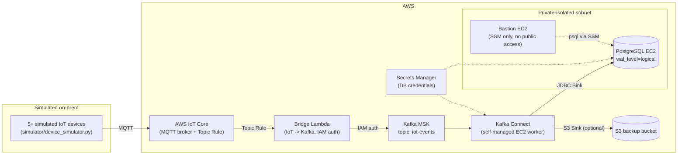
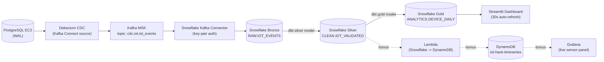

# Architecture

Two phases, matching the hackathon brief. GitHub renders both diagrams below
natively (no external tools required); a PNG/PDF export can be produced with
`npx @mermaid-js/mermaid-cli -i docs/architecture.md -o docs/architecture.png`
if a literal image file is required for submission.

## Phase 1 — IoT Ingestion & On-Premise Simulation

## Phase 2 — Cloud Migration, Processing & Analytics

## Notable adaptations from the brief

- **IoT Core -> Kafka bridge**: AWS IoT Core has no native "publish to MSK"
  rule action. A Lambda bridges the two (IoT Topic Rule invokes it, it
  republishes onto MSK via IAM auth). Fully documented in CloudWatch Logs.
- **IoT Device Simulator**: the official AWS Solutions Library simulator is
  its own 20-30 minute multi-stack deployment with a web console. We built a
  lightweight, swap-compatible Python/MQTT equivalent
  (`simulator/device_simulator.py`) producing the identical geoLocation
  shape from 5+ concurrent devices seeded near the O2 Arena, London.
- **Kafka Connect runs on a self-managed EC2 worker, not AWS MSK Connect**:
  the brief calls for MSK Connect, but this AWS account is gated from
  creating `AWS::KafkaConnect::Connector` resources - confirmed via
  CloudTrail (the deploying role has `AdministratorAccess`, custom plugin
  creation succeeds, only connector creation returns a bare "Access
  denied... reach out to your support representative", which is AWS's
  canned new-account service-gating message, not a real permissions bug).
  `infra/stacks/kafka_connect_ec2_stack.py` runs the identical open-source
  Kafka Connect distributed worker on a plain EC2 instance instead - same
  connector plugins (JDBC sink, S3 sink, Debezium, Snowflake sink), same
  `iot-events` topic, submitted via the worker's own REST API instead of a
  CloudFormation resource.
- **CDC topic name**: our Postgres table lives in schema `iot` (not
  `public`), so the Debezium output topic is `cdc.iot.iot_events` rather
  than the brief's literal `cdc.public.iot_events` example - a naming
  difference only, same mechanism.
- **"AQI trend" chart**: the geoLocation dataset has no air-quality field;
  the Streamlit dashboard substitutes an event-activity trend per device as
  the analogous time-series metric.
- **DynamoDB instead of AWS Timestream (bonus)**: Timestream for
  LiveAnalytics is also closed to new AWS accounts - confirmed via a live
  `cdk deploy` attempt ("Only existing Timestream for LiveAnalytics
  customers can access the service", HandlerErrorCode:
  GeneralServiceException). `infra/stacks/dynamodb_stack.py` uses a
  DynamoDB table (partition key `device_id`, sort key `event_time` epoch
  millis) instead - the same per-device time-range query pattern a
  dashboard needs, queryable from Grafana via the community
  `marcusolsson-dynamodb-datasource` plugin instead of Timestream's native
  one. Verified live: the Lambda reads new rows from
  `CLEAN.IOT_VALIDATED` every minute and writes them to DynamoDB.
- **Cost/time choices**: `kafka.t3.small` brokers (cheapest supported size),
  no NAT Gateway (Kafka Connect sits in a public subnet behind a
  locked-down security group instead; everything else is fully private and
  reachable only via SSM Session Manager through VPC interface endpoints).
